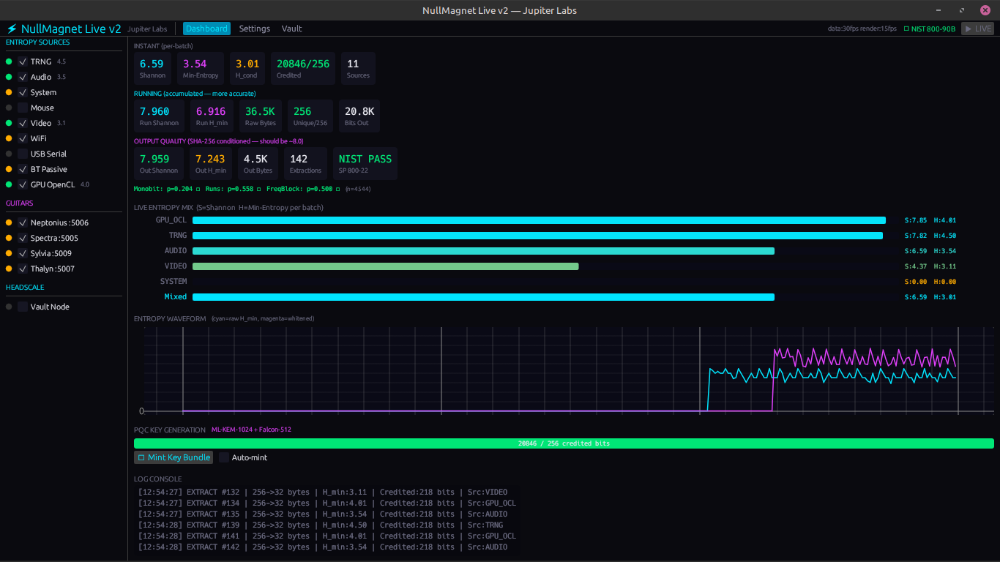

# NullMagnet Live v2



**NullMagnet Live** is an experimental entropy harvesting engine and Post-Quantum Cryptography (PQC) key generator. It is designed to aggregate non-deterministic noise from various hardware sources to seed NIST-standardized PQC algorithms.

> [!WARNING]
> **EXPERIMENTAL SOFTWARE:** This project is currently in an experimental phase. It has not undergone professional cryptographic auditing. **Do not use the generated keys for high-stakes production security or to protect sensitive data.** It is intended for research, development, and testing of entropy harvesting methodologies.

## The GuitaRNG Integration
A primary feature of NullMagnet is its ability to ingest entropy from the **GuitaRNG** project. This allows physical resonance and circuit noise from instrumented guitars to contribute directly to the cryptographic pool.

* **Project Link:** [GuitaRNG-ESP32-S3-Edition](https://github.com/JupitersGhost/GuitaRNG-ESP32-S3-Edition)
* **Mechanism:** NullMagnet listens on specific UDP ports for entropy packets broadcast by ESP32-S3 units embedded within the instruments.

## Environmental and Hardware Harvesters
Beyond the guitar integration, NullMagnet continuously aggregates noise from a wide array of local sensors and system states:
* **Hardware and OS:** TRNG, system CPU and memory state, and mouse/HID timing jitter.
* **Environmental:** Microphone ADC noise and camera frame noise.
* **Signals:** WiFi interface statistics, USB serial noise, Bluetooth passive scheduling jitter, and active BLE RSSI scanning.

## Technical Architecture
* **NIST SP 800-90B Compliance:** Implements Repetition Count Tests (RCT) and Adaptive Proportion Tests (APT) to monitor source health.
* **Conditioning:** Uses SHA-256 vetted conditioning (256 raw bytes to 32 bytes) with a conservative 0.85 entropy credit factor.
* **PQC Standards:** Generates **ML-KEM-1024** (FIPS 203) key pairs and **Falcon-512** (NIST Round 3) signatures.
* **Memory Safety:** Utilizes the `zeroize` crate to wipe secret key material from memory immediately after use.
* **UI:** Built with `egui` for a lightweight, cross-platform native interface.

## Networking and Vault Storage
NullMagnet includes a robust networking layer for distributed entropy sharing and secure key storage:
* **P2P Mesh:** Nodes can distribute harvested entropy to each other, verified by HMAC-SHA256 authentication.
* **Encrypted Vault:** Key bundles are encrypted locally using AES-256-GCM.
* **Headscale Forwarding:** Encrypted key bundles can be pushed directly to remote vault nodes over a private tailnet.

## Build and Run Instructions

### Prerequisites
* **Rust Toolchain:** Install [Rust/Cargo](https://rustup.rs/).
* **GPU Support (Optional):**
    * For NVIDIA: Requires CUDA Toolkit.
    * For AMD/Intel: Requires OpenCL headers/drivers.

### Windows Setup
1.  **Clone the repository:**
    ```powershell
    git clone [https://github.com/JupitersGhost/NullMagnet.git](https://github.com/JupitersGhost/NullMagnet.git)
    cd NullMagnet
    ```
2.  **Build and Run:**
    ```powershell
    # Standard build
    cargo run --release

    # Build with NVIDIA GPU support
    cargo run --release --features gpu-cuda

    # Build with all GPU support and active Bluetooth RSSI scanning
    cargo run --release --features "gpu-all,bt-active"
    ```

### Linux Setup
1.  **Install dependencies (Debian/Ubuntu example):**
    ```bash
    sudo apt update
    sudo apt install build-essential libasound2-dev libx11-dev libwayland-dev libxkbcommon-dev
    ```
2.  **Clone the repository:**
    ```bash
    git clone [https://github.com/JupitersGhost/NullMagnet.git](https://github.com/JupitersGhost/NullMagnet.git)
    cd NullMagnet
    ```
3.  **Build and Run:**
    ```bash
    # Standard build
    cargo run --release

    # Build with OpenCL support
    cargo run --release --features gpu-opencl

    # Build with all advanced features enabled
    cargo run --release --features "gpu-all,bt-active"
    ```

## Configuration
On the first run, the application generates a `nullmagnet.toml` file in the execution directory. You can manually edit this file or use the in-app **Settings** tab to configure:
* **Audio/Video Devices:** Select specific microphones or cameras for noise harvesting.
* **GuitaRNG Nodes:** Enable/disable specific guitar data streams and set their UDP ports.
* **Network:** Configure Headscale targets for encrypted vault pushes and P2P mesh keys.

## License
Licensed under the **Apache License, Version 2.0**.